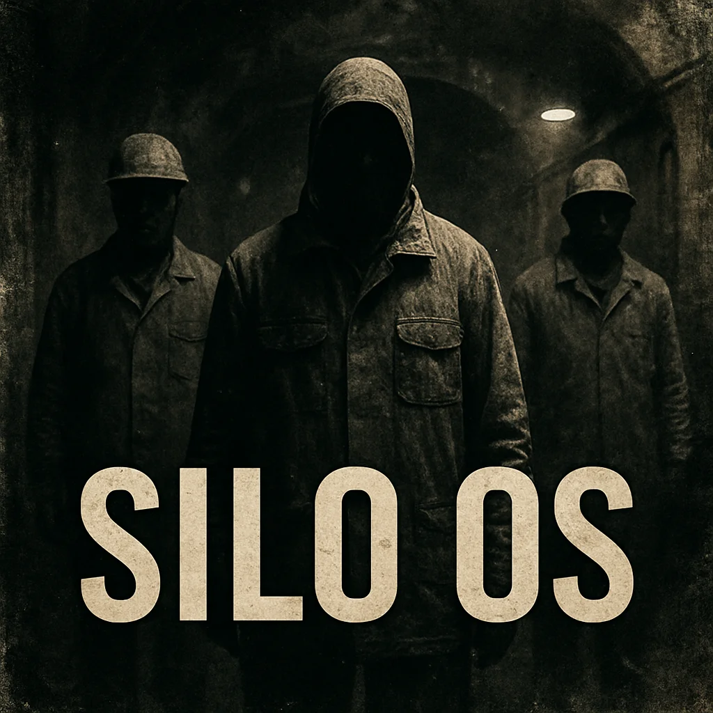

# SiloOS

**The Agent Operating System for AI You Can't Trust**

SiloOS is a security-first, privacy-first execution environment for AI agents. It treats AI as a first-class citizen that happens to be fundamentally untrustworthy—like a rogue employee with superhuman capabilities who needs to be strapped down to a chair and monitored.

## The Matrix in Reverse

**It's the Matrix in reverse.** Instead of humans plugged into a simulation, SiloOS plugs in the agents—and lies to them, politely and securely, about what "reality" is.

Agents don't see the real database. Agents don't see real customers. Agents live inside a padded cell fed a tokenized world—handles, abstractions, shadows projected onto the cell wall. The membrane interprets what the agent *thinks* it's doing, maps it to safe actions, and enforces strict physics inside the simulation.

When an agent hesitates, we plug in a human. Same workspace, same tools—but the human knows the membrane is there. The agent just blinks behind its window, seeing whatever SiloOS allows.

**In the Matrix, humans live in a simulation controlled by machines.**
**In SiloOS, machines live in a simulation controlled by humans.**

---

> *"It's like having a brilliant, dangerous prisoner. You want their insights, you need their capabilities—but you don't trust them as far as you can throw them. So you build a padded cell."*

## The Problem

AI agents are incredibly capable: they can write code, make decisions, communicate, and execute complex workflows at inhuman speed. But they're also:

- **Non-deterministic**: You can't predict exactly what they'll do
- **Untrustable**: Like an external attacker or a rogue employee
- **Dangerous**: Given unrestricted access, they can cause real damage

Traditional approaches try to bolt AI onto legacy systems with "a bit of spit and polish." This doesn't work. A 15-20% productivity gain gets washed away by the overhead of security, governance, and looking over AI's shoulder.

## The Solution: A Padded Cell

SiloOS provides a zero-trust execution environment where agents:

- **Run in isolation**: Each agent lives in its own folder/jail with its own Linux user
- **Never see real data**: All PII is tokenized; agents work with proxied, sanitized data
- **Need tickets for everything**: JWT-based capability tokens control what agents can do
- **Can't touch the database directly**: All data access goes through a security proxy
- **Execute statelessly**: `main.py` runs, does its job, and exits cleanly

## The Paradox: Maximize the AI, Restrict the Exits

**Inside the cell**: The AI has everything it needs. Unlimited LLM access. Flexible environment. Rich context. Full reasoning capabilities.

**At the exits**: Every door is locked, every window barred. Pre-blessed services only. Tokenized data only. Approved actions only.

Trust the intelligence. Distrust the access.

## Core Concepts

### Two Types of Keys

1. **Base Keys**: What the agent is *allowed* to do (refund up to $500, send emails, etc.)
2. **Task Keys**: Access to *this specific customer's* data for *this specific interaction*

An agent's capabilities come from the combination: a refund agent with a $500 limit (base) working on customer #12345's case (task).

### The Router (Kernel)

A central coordinator that:
- Receives incoming tasks (customer chat, email, webhook)
- Mints task keys for the customer/case
- Routes to the appropriate agent
- Handles escalation when agents give up

### Agents Don't Talk to Each Other

No complex inter-agent communication protocols. If an agent can't handle something:
1. It returns control to the router
2. The router hands off to another agent (manager, collections, human)
3. Keys get transferred through the router, not peer-to-peer

### "Plug In a Human"

When an agent goes offline for maintenance, the router simply routes to a human instead. The human gets the same interface, same tools, same markdown procedures. *"Hey, quickly—we've got to plug in a human!"*

## Documentation

| Document | Description |
|----------|-------------|
| [Architecture](docs/architecture.md) | The padded cell: agent isolation, jails, and the kernel |
| [Security Model](docs/security-model.md) | Zero-trust, JWT tokens, capability-based access |
| [Privacy Model](docs/privacy-model.md) | Tokenization and why agents never see real PII |
| [Agent Structure](docs/agent-structure.md) | Anatomy of an agent: folders, markdown, tools |
| [Workflow Patterns](docs/workflow-patterns.md) | Routing, escalation, and human-in-the-loop |
| [Markdown OS](docs/markdown-os.md) | Instructions in natural language, not code |
| [AI First-Class](docs/ai-first-class.md) | Maximize the agent, restrict the exits |
| [Philosophy](docs/philosophy.md) | "Burn it all down" and the AI-first approach |
| [Development](docs/development.md) | Building agents with the "watch what I did" strategy |

## Key Principles

- **Small, Atomic, Inspectable, Shippable**: No monolithic codebases. Each agent is a folder you can version, deploy, and rollback independently.
- **Stateless Execution**: Agents don't maintain state between runs. Task context comes from keys and proxied data.
- **Markdown Operating System**: Agents are guided by markdown files that describe procedures, policies, and escalation paths—like training documents for a human employee.
- **Real-World Parallels**: The system mirrors how human support teams work: routing calls, escalating to managers, transferring to collections.

## Status

SiloOS is currently a conceptual architecture and design specification. Implementation is in progress.

## Author

**Scott Farrell**
[LinkedIn](https://www.linkedin.com/in/sfarrell5123/) | [Email](mailto:scott@leverageai.com.au)

Read the full article: [SiloOS: The Agent Operating System for AI You Can't Trust](https://leverageai.com.au/siloos-the-agent-operating-system-for-ai-you-cant-trust/)

## License

MIT License - See [LICENSE](LICENSE) for details.
